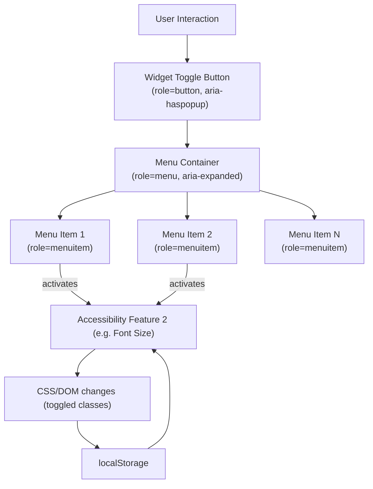
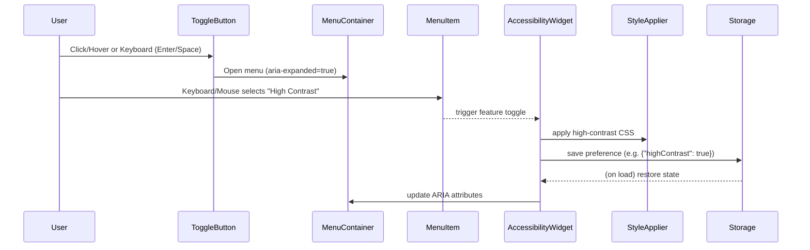

# Accessibility Menu Widget – Product Requirements Document

## Executive Summary  
This project delivers an **accessible, client-side menu widget** that provides a set of user-interface controls (toggles and sliders) for common accessibility enhancements (contrast modes, font sizing, etc.). It is a *pure JavaScript/CSS widget* that can be embedded via a single `<script>` and `<link>` (no external calls or servers). The widget is designed to improve usability for people with disabilities and help site owners offer accessibility options, but **it does not guarantee legal compliance** with accessibility laws.  Users must be informed that this tool is provided *“as-is”* without warranty and that proper accessibility requires following standards, semantic HTML, and manual testing【7†L278-L283】【28†L275-L283】.  

## Scope and Goals  
- **Purpose:** Provide an out-of-the-box accessibility menu that sites can easily include to allow end users to toggle accessibility features (e.g. high-contrast mode, larger text, dyslexia-friendly fonts, etc.).  
- **Client-side Only:** The widget runs entirely in-browser (HTML/CSS/JS) and makes **no server requests or external analytics calls** (GDPR-friendly)【28†L168-L172】.  
- **Compatibility:** Works on major desktop/mobile browsers (Chrome, Firefox, Edge, Safari) and supports RTL layouts and language switching (English/Hebrew shown as example).  
- **Customization:** Themable and extensible via an API (init options, callbacks, events) so developers can integrate and brand it with minimal effort.  
- **Accessibility Focus:** Implements WAI-ARIA patterns and keyboard interactions (e.g. a “menu button” with `role="button"` toggling a `role="menu"` with `role="menuitem"` children【3†L62-L70】【27†L186-L194】).  
- **Persistence:** Uses `localStorage` (or equivalent) to remember user settings across pages/sessions.  
- **No Vendor Lock-in:** Distributed as an open-source npm package/UMD library on GitHub, usable via CDN or bundler.

## Feature Inventory and Behavior  
Based on the reference implementations and screenshots, the widget provides **these core features** (with expected behaviors):

- **Floating Menu Icon:** A persistent icon/button (e.g. at bottom corner). On *hover* or *focus*, it expands to reveal controls. It supports mouse, keyboard, and touch interactions. It uses `role="button" aria-haspopup="menu" aria-expanded` on the toggle element【3†L62-L70】.  
- **Language Toggle (LTR/RTL):** Allows switching between languages (e.g. English/Hebrew). When set to a RTL language, the widget sets `dir="rtl"` on the document or widget container【18†L67-L74】 and updates all labels. The HTML `lang` attribute should also change accordingly【18†L106-L112】.  
- **High-Contrast/Dark Modes:** Buttons to toggle color schemes (e.g. light/normal, high-contrast, dark). Implemented via CSS classes or filters. These help satisfy WCAG contrast criteria (e.g. SC 1.4.3) but do not guarantee compliance【7†L278-L283】.  
- **Invert/Grayscale Filter:** Additional color filters (invert colors, grayscale, color-blindness filters) for cognitive support or color-deficiency (optional future feature).  
- **Font Adjustments:** Controls to increase/decrease font size, line height, and letter spacing (WCAG 1.4.4/1.4.12). The widget modifies CSS properties globally or on key containers.  
- **Dyslexia-Friendly Font:** Toggle to apply a dyslexia-optimized font (e.g. OpenDyslexic) or other readable fonts.  
- **Text Spacing & Alignment:** Options to toggle extra spacing and to align text (left/center/right) to improve readability.  
- **Hide Images / Text-Only Mode:** Option to hide decorative images, leaving only text (for screen-reading focus or low bandwidth).  
- **Link Underlining:** Toggle to underline all links (WCAG 1.4.1) to improve visibility.  
- **Highlight Headings:** Visually emphasize headings (e.g. with background or border) to improve content navigation.  
- **Cursor and Focus Enhancements:** 
  - “Large Cursor”: Increase mouse cursor size (help for motor-impaired users). 
  - “Focus Outline”: Ensure a visible focus ring (WCAG 2.4.7) on all interactive elements; enable/disable as needed.  
- **Motion Control:** 
  - “Reduce Motion”: Pause or remove non-essential animations (honor `prefers-reduced-motion`【15†L49-L57】 to avoid vestibular triggers). 
  - “Stop Autoplay”: Stop animated/GIF/auto-playing media (WCAG 2.2.2).  
- **Reading Mode:** Features like a reading mask or screen-reader text-to-speech (integrate with browser's Web Speech API). 
- **Content Layout:** Adjust content width or enable a reading ruler (mask) to guide line reading. 
- **State Persistence:** All settings are saved in localStorage (or cookies) so they persist across page loads【21†L307-L310】. A unique `storageKey` should be used to avoid collisions. 

Each control must have clear **ARIA semantics** and labels. Toggle buttons can use `<button aria-pressed>` or `role="menuitemcheckbox"` with `aria-checked` to indicate state【27†L198-L202】【27†L209-L211】. The menu itself should have `role="menu"` (or `menubar` if persistent) and each item `role="menuitem"`, with appropriate `aria-labels`. For example, the widget toggle might be `<button aria-label="Accessibility Options" aria-haspopup="menu" aria-expanded="false">🔧</button>`.

## Keyboard and Screen-Reader Accessibility  
The widget must support full keyboard navigation following WAI-ARIA best practices【3†L50-L58】【20†L90-L97】:
- **Open/Close Menu:** When the menu toggle has focus, pressing **Enter** or **Space** opens the menu and moves focus into it【3†L50-L58】. (Optionally, Down/Up arrows can also open it.) 
- **Navigate Menu Items:** Once open, items use arrow keys (Up/Down/Right/Left as appropriate) to navigate【20†L90-L97】. When a menuitem is focused, **Enter/Space** activates that option. 
- **Escape/Tab:** **Escape** closes the menu and returns focus to the toggle【27†L158-L160】. Likewise, pressing **Tab** (or Shift+Tab) when focus is inside the menu moves focus out and closes all submenu layers【20†L90-L97】.  
- **ARIA Announcements:** Screen readers (e.g. NVDA, VoiceOver) will announce the button and menu roles. Ensure the menu toggle has an accessible name (`aria-label` or visible text) and that each control’s purpose is readable. For custom controls (like sliders), ensure keyboard operability and proper ARIA roles.  
- **Screen-reader Testing:** The widget’s menu and controls should be tested with major screen readers (NVDA on Windows, VoiceOver on macOS/iOS, TalkBack on Android) to verify labels and navigation.

## Focus Management  
- When the menu opens, focus should be placed on the **first menu item**【3†L50-L58】.  
- Disabled items (if any) should receive `aria-disabled="true"` and be skipped by keyboard.  
- If focus leaves the widget (tabbing out), the menu should close automatically. 
- The widget should use ARIA attributes such as `aria-expanded`, `aria-controls` on the toggle and `aria-activedescendant` or `tabindex` shifting to manage focus within the menu【27†L198-L206】.  

## State Persistence (LocalStorage)  
The widget saves user preferences (which features are active) in `localStorage` so settings are retained on page reload【21†L307-L310】. Use a unique key (e.g. `'a11yWidgetSettings'`). The storage schema should allow migrating older versions gracefully. Provide an API method to **reset to defaults** (clearing storage). Note: ensure no sensitive information is stored (only toggle states).

## RTL/LTR and Language Support  
- Provide built-in support for at least two languages (e.g. English and Hebrew as shown). All UI text (labels, tooltips) should be stored as translations (e.g. JSON or JS object).  
- When a RTL language is selected, set `dir="rtl"` on the HTML or widget container and reorder the menu layout to match RTL flow【18†L67-L74】. Use logical CSS properties (`margin-inline-start`/`end`) to simplify mirroring.  
- The HTML `<html lang="xx">` attribute must be updated to the active language【18†L106-L112】.  
- Document how to add new language packs (e.g. provide a JSON file with keys for each label).  

## Responsive Behavior  
- The widget must work on different screen sizes. On mobile/touch, tapping the icon should open the menu (since hover is not reliable).  
- Use CSS media queries to adapt layout (for small screens, the menu might expand as an overlay or panel).  
- Ensure touch targets (buttons, sliders) are large enough (per WCAG 2.5).  
- The menu should not overflow the viewport; it can scale or scroll if needed.

## Theming and Branding  
- Default styles should use CSS variables (custom properties) for colors, fonts, and sizes, so that consumers can easily override them for branding (e.g. `--a11y-bg-color`, `--a11y-btn-color`).  
- The widget’s CSS class names follow BEM conventions (`.a11y-widget`, `.a11y-widget__toggle`, `.a11y-widget__menu`, `.a11y-widget__item`, with modifiers like `--open`, `--active`, `--rtl`) to minimize conflicts.  
- Allow passing a **theme object** or CSS file override at init time. Provide light/dark themes by default.

## Customization API  
Expose an initialization method, e.g. `AccessibilityWidget.init(options)`, where `options` may include:  
- `defaultLanguage`: e.g. `"en"` (default language code)  
- `languages`: mapping of codes to labels (e.g. `{ en: "English", he: "עברית" }`)  
- `features`: enable/disable individual features if needed  
- `onToggle(featureName, isActive)`: callback when a feature is toggled  
- `onOpenMenu()`, `onCloseMenu()`: hooks for menu open/close events  
- Event emitter or callbacks for custom events (e.g. `widget.emit('featureChange', {...})`).  

Ensure the API is documented and testable.  

## Integration Instructions  
To use the widget, include its CSS and JS at the end of the `<body>` (so it can find the page content)【28†L299-L303】:  

```html
<html lang="en" dir="ltr">
  <head>
    <link rel="stylesheet" href="a11y-widget.css">
  </head>
  <body>
    ...page content...
    <script src="a11y-widget.umd.min.js"></script>
    <script>
      AccessibilityWidget.init({
        defaultLanguage: 'en',
        languages: { en: 'English', he: 'עברית' },
        // other options...
      });
    </script>
  </body>
</html>
```

The widget should **not** require any server-side components. It can alternatively be installed via npm (`npm install a11y-widget`) and imported as an ES module or CommonJS (`import 'a11y-widget';`). For CDN, links such as `https://cdn.jsdelivr.net/npm/a11y-widget/dist/a11y-widget.umd.min.js` should be supported.  

## Packaging and Distribution  
- Use a build tool (e.g. Rollup) to produce both a UMD bundle for browsers and an ES module for bundlers.  
- Publish releases on GitHub and npm. Use Semantic Versioning (see Release Plan below).  
- Provide a minified CSS file. Bundle all assets (icons, fonts) or load via CSS.  
- Provide guidance for CDN usage (jsDelivr/unpkg). Example from a similar project: `<script src="https://cdn.jsdelivr.net/npm/accessibility-widgets@latest/widget.js"></script>`【7†L298-L304】.  

## Build/Test Pipeline (CI/CD)  
- **GitHub Actions** workflows: 
  - **CI Pipeline (`ci.yml`):** On each PR/push run lint (ESLint), unit tests (Jest), and accessibility tests (using [axe-core](https://github.com/dequelabs/axe-core)【11†L385-L393】 as part of integration tests). For example, a test can inject the widget into a sample page and run `axe.run()` to catch WCAG violations. 
  - **Release Pipeline (`release.yml`):** On pushing a version tag, build and publish to npm and create a GitHub release with artifacts (js/CSS). 
- **Automated Tests:** Include unit tests for core functions, and end-to-end tests (e.g. with Puppeteer or Cypress) that simulate user interactions (open menu, toggle features) and verify DOM changes. Use Axe to catch regressions【11†L385-L393】.
- **Linting:** Enforce code style (ESLint/Prettier) and flag common accessibility errors (e.g. missing `alt`, improper ARIA) in code review. 
- **Performance Budget:** Keep the minified JS bundle small (e.g. < 50KB). Lazy-load non-essential features if needed.  

## Performance and Security  
- The widget should be lightweight and load asynchronously if possible. It must not significantly impact page load time. Aim for a small script and CSS footprint.  
- **No external calls:** All functionality runs offline. **Do not** include analytics, tracking, or calls to external services (e.g. no third-party CDNs for icons, no web API for voices). This respects user privacy (GDPR-safe)【28†L168-L172】.  
- **Safe coding:** Avoid `eval()`. Sanitize any dynamic HTML insertion. CSP compatibility should be considered (use only non-eval code and allow listing of necessary inline styles if any).  
- **Dependencies:** Prefer zero dependencies. If needed, use only well-known, audited libraries (e.g. for text-to-speech if implemented).

## Accessibility Conformance Targets  
- **Standard:** Aim for **WCAG 2.1 Level AA** compliance *baseline*. The widget’s features specifically address guidelines like Contrast (1.4.3), Text Resize (1.4.4), Content on Hover (1.4.13), Motion (2.3.3), etc. However, **note** that providing a widget **does not guarantee site-wide compliance**【7†L278-L283】.  
- **ARIA Compliance:** Follow WAI-ARIA Authoring Practices for menus【3†L50-L58】【27†L158-L160】. Ensure all interactive elements have appropriate roles/labels.  
- **Limitations:** The widget cannot fix fundamental content issues (missing alt text, non-semantic HTML, etc.). It’s an enhancement tool, not a replacement for proper development practices. The README and UI will explicitly state: *“This tool helps meet accessibility guidelines but does **not** ensure full compliance. Use with caution and perform an audit.”*【7†L278-L283】  

## Automated and Manual Testing Plan  
- **Unit Tests:** Test individual functions (e.g. toggling classes, saving settings).  
- **Integration/E2E Tests:** Load the widget on sample pages. Test interactions with various input methods (keyboard, mouse, screen-reader). Use [axe-core](https://github.com/dequelabs/axe-core) in automated tests to detect common accessibility issues【11†L385-L393】.  
- **Manual Tests:** 
  - *Screen Readers:* Verify with NVDA (Windows), VoiceOver (macOS/iOS), and TalkBack (Android) that all menu elements are announced correctly.  
  - *Keyboard Only:* Ensure Tab/Shift+Tab, arrow keys, and Escape behave as specified【20†L90-L97】【27†L158-L160】.  
  - *Browsers:* Test on latest Chrome, Firefox, Safari, and Edge. Optionally test IE11 if legacy support needed.  
  - *Devices:* Test on desktop, tablet, and phone (responsive checks).  
  - *Reduced Motion:* On a device with “reduce motion” enabled (OS setting), check that any animations (e.g. menu opening) are disabled or very subtle【15†L49-L57】.  
  - *VoiceOver Focus:* Ensure focus rings remain visible under all modes.  
- **Test Matrix:** The following table outlines a representative test matrix:

| Environment       | Chrome      | Firefox     | Safari      | Edge        | IE11 (opt.) |
| ----------------- |:-----------:|:-----------:|:-----------:|:-----------:|:-----------:|
| **Keyboard Nav**  | ✓ tested    | ✓ tested    | ✓ tested    | ✓ tested    | Partial     |
| **NVDA**          | ✓ tested    | ✓ tested    | –           | ✓ tested    | ✗ (no NVDA) |
| **VoiceOver (mac)** | –         | –           | ✓ tested    | –           | –           |
| **VoiceOver (iOS)** | ✓ tested  | –           | –           | –           | –           |
| **TalkBack (Android)** | ✓ tested | –        | –           | –           | –           |
| **Screen Reader** | NVDA/JAWS   | NVDA        | VoiceOver   | NVDA        | N/A         |

(*Legend:* ✓ = passed; ✗ = unsupported; – = not applicable)  

## CSS Class Names and BEM  
Use consistent BEM naming for styling:  
- **Block:** `.a11y-widget` – the root container.  
- **Elements:** `.a11y-widget__toggle`, `.a11y-widget__menu`, `.a11y-widget__item`, `.a11y-widget__control`, `.a11y-widget__slider`, etc.  
- **Modifiers:** `.a11y-widget--open`, `.a11y-widget--rtl`, `.a11y-widget__item--active`, `.a11y-widget__button--pressed`, etc.  

For example:  
```html
<button class="a11y-widget__toggle" aria-haspopup="menu" aria-expanded="false" aria-label="Accessibility Options">⚙️</button>
<ul class="a11y-widget__menu" role="menu">
  <li role="menuitem"><button class="a11y-widget__control" aria-pressed="false">High Contrast</button></li>
  <li role="menuitem"><button class="a11y-widget__control" aria-pressed="false">Hide Images</button></li>
  <!-- more items -->
</ul>
```

## Keyboard Shortcuts (Access Keys)  
As an optional feature, the widget **may** support an access key or `aria-keyshortcuts` on the toggle button (e.g. Alt+W) for power users. However, HTML `accesskey` is known to be unreliable and conflict-prone【23†L41-L49】【23†L124-L133】, so this should be documented as optional and used with caution. The primary keyboard navigation relies on standard tab/enter/arrow keys as per ARIA patterns.  

## Animations and Reduced-Motion  
All show/hide animations (like sliding open the menu) **must** respect the user’s OS-level motion settings. Use CSS `@media (prefers-reduced-motion: reduce)` to turn off or simplify animations【15†L49-L57】. Provide a manual “Reduce Motion” toggle as an explicit feature. 

## Images and Icon Handling  
- Use **SVG icons** or font-icons for buttons. Each icon button must have an `aria-label` or be hidden from assistive tech if decorative (`aria-hidden="true"`).  
- If using `` for any UI graphic, include an `alt` attribute (or empty `alt=""` if purely decorative).  
- All graphical assets (icons, example screenshots for README) should be included in an `/assets` folder. Provide recommended alt-texts in documentation. 

## Localization Strategy  
- Store all UI strings in a localization file or object keyed by language code. For example:
  ```js
  const i18n = {
    en: { toggle_label: "Accessibility Menu", highContrast: "High Contrast", /* ... */ },
    he: { toggle_label: "תפריט נגישות", highContrast: "ניגודיות גבוהה", /* ... */ }
  };
  ```
- At init, render text from the selected language. Allow developers to supply additional translations for new languages.  
- Use the HTML `lang` attribute on the root element for screen readers, matching the chosen language【18†L106-L112】.  

## Legal and Support Disclaimers  
This component is a **toolkit only** and *not legal advice*. Disclaimers must be prominent in multiple places:

- **UI Footer or Tooltip (short):**  
  *“Accessibility options provided by this widget do **not** guarantee full legal compliance. Use at your own risk.”*  

- **README (long form):**  
  Include a bold disclaimer section, for example:  
  > **Disclaimer:** This widget is provided *“AS IS”* without warranty. It helps implement various accessibility features but **does NOT ensure** full compliance with ADA, WCAG, or other standards【7†L278-L283】. It is the responsibility of site owners to test and ensure accessibility. No support or guarantee is provided; using this tool is at the user’s own risk.  

- **LICENSE File:**  
  Choose a license that includes a liability disclaimer (see “License” section below). For example, MIT and Apache-2.0 include no-warranty clauses. Include an explicit note in LICENSE or README: “No warranties, use at your own risk.”  

Always clarify that **user assumes all risk**. For example, a short UI note could be:  
> *“⚠️ This widget does not replace an accessibility audit. It is provided without any warranty. Users remain responsible for legal compliance.*”  

## Open-Source License Recommendation  
Consider the following popular licenses:

| Feature                  | MIT (permissive)   | Apache 2.0 (permissive + patent) | GPLv3 (copyleft)          |
| ------------------------ | ------------------ | -------------------------------- | ------------------------ |
| **Type**                 | Permissive (no strings)【13†L39-L47】  | Permissive + patent grant【13†L41-L47】  | Strong copyleft【13†L48-L52】    |
| **Permissions**          | Commercial use, modification, private use without obligation | Same as MIT, plus explicit patent license | Use/modification *only* if derived works also GPL |
| **Patent Grant**         | No explicit grant  | Included (protects against patent claims)【13†L41-L47】 | Included in GPLv3 |
| **Distribution**         | No requirement to open-source modifications | No requirement either | Must distribute derivative under GPL |
| **Usage by Companies**   | Very flexible; companies often prefer it【13†L55-L64】 | Flexible; companies appreciate patent protection | Some avoid due to viral nature【13†L93-L100】 |
| **Attribution**          | Must include original copyright/license | Same | Must include license and source |
| **Ideal for**            | Broad adoption, minimal fuss【13†L55-L64】 | Projects concerned about patents or corporate use | Ensuring code stays open-source |

Given the goal of wide adoption and minimal legal friction, **MIT License** is recommended. It is short, permissive, and familiar to most developers【13†L55-L64】. Apache 2.0 is a close alternative (adds a patent clause). GPL’s copyleft nature can deter some users (since any derived work would have to be open-sourced)【13†L48-L52】. For maximum use in diverse projects, MIT or Apache 2.0 is preferred.  

## CONTRIBUTING.md Outline  
The `CONTRIBUTING.md` file should include:  
- **Welcome:** Brief intro inviting contributions.  
- **Code of Conduct:** Reference a standard (e.g. [Contributor Covenant](https://www.contributor-covenant.org/)).  
- **Reporting Issues:** How to file bug reports or feature requests (with templates, see below).  
- **Environment Setup:** Instructions to run/build/tests locally (Node version, npm scripts).  
- **Style Guidelines:** Code style (ESLint rules, indentation, BEM for CSS).  
- **Testing:** How to run tests locally (`npm test`, etc.).  
- **Pull Request Process:** Branching model (e.g. feature branches), description guidelines, linking issues.  
- **Review Expectations:** Mention that all PRs should include tests for new features and documentation changes.  

## Issue Templates  
In `.github/ISSUE_TEMPLATE/`, provide at least three templates:

- **Bug Report:**  
  Fields for summary, steps to reproduce, expected vs. actual behavior, browser/OS version, any console errors/screenshots.  
- **Feature Request:**  
  Fields for proposed feature, rationale/use-case, priority.  
- **Legal/Support Inquiry:**  
  For accessibility/legal concerns (e.g. *“Does using this widget fulfill [specific law]?”*). Provide a disclaimer: *“Note: This is not legal advice.”*  

Each template should remind users to include relevant info and emphasize this is an open-source project without legal liability.

## Pull Request Checklist  
Each PR should include a checklist (as part of PR description or template), requiring:  
- [ ] **Accessibility:** New UI elements must have ARIA roles/labels, keyboard interactions, and have been tested with a screen reader.  
- [ ] **Tests:** Unit tests are provided (or existing tests updated) and passing.  
- [ ] **Documentation:** README and docs updated with any new configuration, features or changes.  
- [ ] **Lint:** Code is linted and formatted.  

## Project Governance  
- **Maintainer(s):** The repository owner/author is the initial maintainer, responsible for reviewing all contributions and making final decisions.  
- **Contributors:** Others may submit PRs. Encourage a collaborative review process.  
- **Decision Process:** Use consensus among maintainers; adopt [“BDFL” style](https://en.wikipedia.org/wiki/Benevolent_dictator_for_life) if desired (i.e. maintainer has final say).  
- **Code of Conduct:** Adopt a standard CoC (e.g. Contributor Covenant) and include it in the repo. All community interactions must be civil and inclusive.  

## Release and Versioning Plan  
- **Versioning:** Use [Semantic Versioning](https://semver.org/) (major.minor.patch).  
  - **Major:** Breaking API changes (e.g. init API change, removal of features).  
  - **Minor:** New features (e.g. adding a toggle or language) without breaking existing API.  
  - **Patch:** Bug fixes or minor improvements.  
- **Changelog:** Maintain a `CHANGELOG.md` noting new features, fixes, and migrations.  
- **Releases:** Tag releases on GitHub. Attach compiled artifacts (UMD/ESM bundles). Publish to npm on each release.  
- **Upgrade/Migration Path:** Document breaking changes in CHANGELOG and README. When deprecating features, issue console warnings and keep deprecated code for one major version before removal. Provide alternative approaches.  

## CI/CD (GitHub Actions)  
- **CI Pipeline (`.github/workflows/ci.yml`):**  
  - Trigger on PRs and pushes to main.  
  - Steps: checkout, install deps, lint (ESLint), build, run tests, run axe audit.  
- **Release Pipeline (`.github/workflows/release.yml`):**  
  - Trigger on new tag.  
  - Steps: checkout, install, build artifacts, run tests.  
  - Publish to npm (`npm publish`) using secrets.  
  - Create GitHub Release with notes from CHANGELOG and attach build.  
- Optionally integrate CodeQL or other security scans for dependencies.  

## Migration and Deprecation Policy  
- **Deprecation Warnings:** When removing a feature or changing behavior, emit a console warning with instructions.  
- **Deprecated Versions:** Old major versions remain archived on npm (e.g. `1.x` branch) for at least 1 year.  
- **Documentation:** Provide an upgrade guide section in the README for migrating between major versions (e.g. `v1.x -> v2.x`).  

## Repository Structure  
A minimal structure example:  
```
/src                   # Source code (ES6 modules, SASS/CSS)
  a11y-widget.js       # main entry (ESM)
  index.js             # UMD entry point
  /i18n                # localization files (en.json, he.json, etc.)
/dist                  # Built assets (UMD, ESM, CSS, source maps)
/assets                # Icons, screenshots, other static assets
/test or __tests__     # Unit and integration tests
.github/               # GitHub configs (workflows, ISSUE_TEMPLATE, pull_request_template)
/examples              # Example usage (HTML files demonstrating integration)
README.md
CHANGELOG.md
LICENSE
CONTRIBUTING.md
CODE_OF_CONDUCT.md
```

## Example Usage Snippets  
### Initialization (HTML)  
```html
<script src="dist/a11y-widget.umd.min.js"></script>
<script>
  AccessibilityWidget.init({
    defaultLanguage: 'en',
    languages: { en: 'English', he: 'עברית' },
    onToggle: (feature, isActive) => {
      console.log(feature + ' is now ' + (isActive ? 'on' : 'off'));
    }
  });
</script>
```

### Initialization (ES Module)  
```js
import AccessibilityWidget from 'a11y-widget';
AccessibilityWidget.init({
  defaultLanguage: 'en',
  storageKey: 'mySiteA11y',
  // ...
});
```

### CSS Class Example  
```css
/* Styles using BEM classes */
.a11y-widget { position: fixed; bottom: 1em; right: 1em; /* ... */ }
.a11y-widget__toggle { /* icon/button style */ }
.a11y-widget__menu { display: none; /* becomes visible when .a11y-widget--open is on parent */ }
.a11y-widget--open .a11y-widget__menu { display: block; }
.a11y-widget__item { list-style: none; }
.a11y-widget__item--active { background-color: var(--a11y-active-bg); }
```

## Diagrams  





## Tables

**Feature Priority (MVP vs. Later):**

| Feature                             | Priority       |
|-------------------------------------|----------------|
| Language Toggle (e.g. EN/HE + RTL)  | **MVP**        |
| High Contrast/Dark Mode Toggle      | **MVP**        |
| Font Size Adjustment                | **MVP**        |
| Dyslexia-Friendly Font              | **MVP**        |
| Underline Links                     | **MVP**        |
| Focus Outline Toggle                | **MVP**        |
| Hide Images                         | **MVP**        |
| Text Spacing / Line Height          | **Later**      |
| Color Inversion / Filters          | **Later**      |
| Reading Mask / Cursor Aid           | **Later**      |
| Pause Animations / Motion Control   | **Later**      |
| Text-to-Speech (Web Speech API)     | **Later**      |
| Voice Commands                      | **Future**     |

**License Tradeoffs:**

(See **Open-Source License Recommendation** section above for discussion and citations【13†L39-L47】【13†L48-L52】.)

**Test Matrix (Environments):** 

| Feature / Platform         | Chrome (Win) | Firefox (Win) | Edge | Safari (macOS) | iOS Safari | Android Chrome |
| -------------------------- |:-----------:|:-------------:|:----:|:-------------:|:----------:|:--------------:|
| Keyboard Navigation (Tab/Enter/Arrows) | ✓ | ✓ | ✓ | ✓ | ✓ | ✓ |
| NVDA Screen Reader         | ✓ | ✓ | ✓ | – | – | – |
| VoiceOver (macOS)          | – | – | – | ✓ | ✓ | – |
| TalkBack (Android)         | – | – | – | – | – | ✓ |
| CSS `prefers-reduced-motion` | ✓ | ✓ | ✓ | ✓ | ✓ | ✓ |

*(✓ = tested/pass; – = not applicable)*

---

> *Primary references:* W3C’s ARIA Authoring Practices【3†L50-L58】【27†L158-L160】 and WCAG techniques【15†L49-L57】 were used to ensure correct keyboard/ARIA implementation. Feature examples are drawn from existing open-source widgets【28†L275-L283】【7†L278-L283】, and license guidance from OSS industry analysis【13†L39-L47】【13†L48-L52】. These sources have been cited inline.